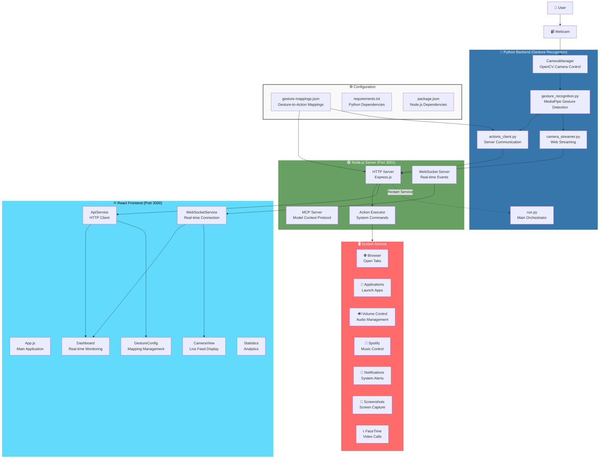

# BigRedHacks Gesture Recognition System - Architecture Diagram

## System Overview

This document provides a comprehensive architectural diagram of the BigRedHacks Gesture Recognition System, showing the interaction between all components and data flow.

## Architecture Diagram



## Component Details

### 🐍 Python Backend Components

1. **run.py** - Main orchestrator that coordinates all components
2. **gesture_recognition.py** - Core gesture detection using MediaPipe
3. **CameraManager** - OpenCV-based camera control and frame capture
4. **actions_client.py** - Communication client for sending gestures to server
5. **camera_streamer.py** - Streams camera feed to web frontend

### 🟢 Node.js Server Components

1. **MCP Server** - Model Context Protocol implementation for tool integration
2. **HTTP Server** - Express.js REST API for frontend communication
3. **Action Executor** - Executes system commands based on gesture mappings

### ⚛️ React Frontend Components

1. **App.js** - Main application with routing and state management
2. **Dashboard** - Real-time monitoring and system status
3. **CameraView** - Live camera feed display
4. **GestureConfig** - Gesture-to-action mapping management
5. **Statistics** - Analytics and performance metrics
6. **ApiService** - HTTP API client

### 🖥️ System Actions

The system can execute various system actions:
- **Browser Control**: Open new tabs, navigate to URLs
- **Application Launch**: Open system applications
- **Audio Control**: Volume adjustment, mute/unmute
- **Media Control**: Spotify play/pause, next/previous track
- **System Functions**: Screenshots, notifications, FaceTime calls
- **Custom Commands**: Execute arbitrary shell commands

## Data Flow

### 1. Gesture Detection Flow
```
Camera → CameraManager → GestureRecognizer → ActionsClient → Node.js Server → System Actions
```

### 2. Web Streaming Flow
```
Camera → CameraManager → CameraStreamer → Node.js Server → WebSocket → React Frontend
```

### 3. Configuration Flow
```
React Frontend → HTTP API → Node.js Server → gesture-mappings.json → Python Backend
```

### 4. Real-time Updates Flow
```
Python Backend → WebSocket → React Frontend (Dashboard, CameraView)
```

## Communication Protocols

- **HTTP REST API**: Frontend ↔ Node.js Server
- **WebSocket**: Real-time events and camera streaming
- **MCP Protocol**: Tool integration and resource access
- **System Commands**: Node.js Server → Operating System

## Port Configuration

- **React Frontend**: Port 3000
- **Node.js Server**: Port 3001
- **Python Backend**: No fixed port (communicates via HTTP/WebSocket)

## Key Features

- **Real-time Gesture Recognition**: 17+ supported gestures
- **Live Camera Streaming**: Web-based camera feed with overlays
- **System Action Execution**: Cross-platform system control
- **WebSocket Communication**: Real-time event broadcasting
- **Configurable Mappings**: Dynamic gesture-to-action configuration
- **Service Management**: Frontend-controlled Python service restart
- **Cross-platform Support**: macOS, Windows, Linux compatibility

## Startup Sequence

1. **Node.js Server** starts on port 3001
2. **React Frontend** starts on port 3000
3. **Python Backend** starts with `--web-stream` flag
4. All components establish communication channels
5. System ready for gesture recognition and control
